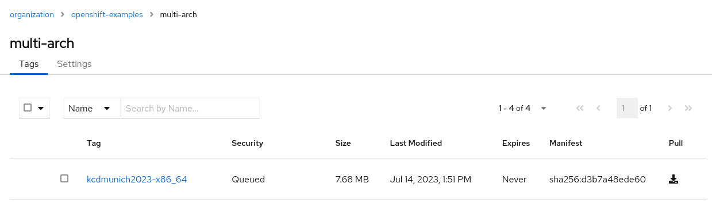

# Demystifying Container Images: Unveiling the Secrets of Multi-Architecture, Manifests, IDs, and Digests

## Build container image (amd64/x86_64)

```bash
[root@centos-amd64 multi-arch]# buildah bud -f Containerfile \
    -t quay.io/openshift-examples/multi-arch:kcdmunich2023-$(uname -m) .

STEP 1/2: FROM registry.access.redhat.com/ubi9/ubi-micro AS runner
Trying to pull registry.access.redhat.com/ubi9/ubi-micro:latest...
Getting image source signatures
Checking if image destination supports signatures
Copying blob 940034fae708 done
Copying config 995a64c3e9 done
Writing manifest to image destination
Storing signatures
STEP 2/2: CMD ["uname","-om" ]
COMMIT quay.io/openshift-examples/multi-arch:kcdmunich2023-x86_64
Getting image source signatures
Copying blob e54dc53d0edb skipped: already exists
Copying blob 5f70bf18a086 done
Copying config f89495e3e0 done
Writing manifest to image destination
Storing signatures
--> f89495e3e0be
Successfully tagged quay.io/openshift-examples/multi-arch:kcdmunich2023-x86_64
f89495e3e0be655cdd4abc0048fbd3974658e9c07296ff4cdcf5e4e3226edc41
```

List images (not pushed, yet)
```
[root@centos-amd64 multi-arch]# podman images --digests --no-trunc
REPOSITORY                                 TAG                   DIGEST                                                                   IMAGE ID                                                                 CREATED         SIZE
quay.io/openshift-examples/multi-arch      kcdmunich2023-x86_64  sha256:d9b46d23c9f8f39b3ec5c1422038d19f4f2604df7d5ec24dce62ef3841c581e3  sha256:f89495e3e0be655cdd4abc0048fbd3974658e9c07296ff4cdcf5e4e3226edc41  48 seconds ago  26.1 MB
registry.access.redhat.com/ubi9/ubi-micro  latest                sha256:57ac8525717f02853b992b0fab41752d4120e5d85163acd8ab696c8a94a715b5  sha256:995a64c3e9344d8de878be45556a32ef243a141cc02e8daa71debb1bf926545e  4 weeks ago     26.1 MB
```

<details>
  <summary>Discover image details - Manifest (`sha256:d9b46d23c9f8`)</summary>

### Discover image details - Manifest (`sha256:d9b46d23c9f8`)

```bash
# Get Digest
[root@centos-amd64 multi-arch]# skopeo inspect --raw containers-storage:quay.io/openshift-examples/multi-arch:kcdmunich2023-x86_64  | sha256sum
INFO[0000] Not using native diff for overlay, this may cause degraded performance for building images: kernel has CONFIG_OVERLAY_FS_REDIRECT_DIR enabled
d9b46d23c9f8f39b3ec5c1422038d19f4f2604df7d5ec24dce62ef3841c581e3  -
```

```json
{
  "schemaVersion": 2,
  "mediaType": "application/vnd.oci.image.manifest.v1+json",
  "config": {
	"mediaType": "application/vnd.oci.image.config.v1+json",
	"digest": "sha256:f89495e3e0be655cdd4abc0048fbd3974658e9c07296ff4cdcf5e4e3226edc41",
	"size": 4236
  },
  "layers": [
	{
  		"mediaType": "application/vnd.oci.image.layer.v1.tar",
  		"digest": "sha256:e54dc53d0edbbc96d3307fdea7bc1ed433d9083a1aab033dc3b38fd8b4fb165a",
  		"size": 26090496
	},
	{
  		"mediaType": "application/vnd.oci.image.layer.v1.tar",
  		"digest": "sha256:5f70bf18a086007016e948b04aed3b82103a36bea41755b6cddfaf10ace3c6ef",
  		"size": 1024
	}
  ],
  "annotations": {
	"org.opencontainers.image.base.digest": "sha256:18a01cb5c53560ca2295e8a218454fe33b330ad6fac0d0ea43a513cd93787b7f",
	"org.opencontainers.image.base.name": "registry.access.redhat.com/ubi9/ubi-micro:latest"
  }
}
```
</details>

<details>
  <summary>Discover image details - Config (`sha256:f89495e3e0be`)</summary>

### Discover image details - Config (`sha256:f89495e3e0be`)

```bash
# Get ImageID
skopeo inspect --raw  containers-storage:quay.io/openshift-examples/multi-arch:kcdmunich2023-x86_64   | jq '.config.digest'
INFO[0000] Not using native diff for overlay, this may cause degraded performance for building images: kernel has CONFIG_OVERLAY_FS_REDIRECT_DIR enabled
"sha256:f89495e3e0be655cdd4abc0048fbd3974658e9c07296ff4cdcf5e4e3226edc41"
```

```json
{
  "created": "2023-07-14T11:49:23.062774594Z",
  "architecture": "amd64",
  "os": "linux",
  "config": {
	"Env": ["PATH=/usr/local/sbin:/usr/local/bin:/usr/sbin:/usr/bin:/sbin:/bin"],
	"Cmd": ["uname","-om"],
	"Labels": {
  		"architecture": "x86_64",
  		"build-date": "2023-06-15T11:05:34",
[...snipped...]
	}
  },
  "rootfs": {
	"type": "layers",
	"diff_ids": [
  		"sha256:e54dc53d0edbbc96d3307fdea7bc1ed433d9083a1aab033dc3b38fd8b4fb165a",
  		"sha256:5f70bf18a086007016e948b04aed3b82103a36bea41755b6cddfaf10ace3c6ef"
	]
  },
  "history": [
	[...snipped...]
  ]
}
```
</details>

## Push container image (amd64/x86_64)

```
[root@centos-amd64 multi-arch]# podman push quay.io/openshift-examples/multi-arch:kcdmunich2023-x86_64
Getting image source signatures
Copying blob 5f70bf18a086 done
Copying blob e54dc53d0edb done
Copying config f89495e3e0 done
Writing manifest to image destination
Storing signatures
```




## 😱 Different digest


```bash
# Get Manifest from local image
[root@centos-amd64 overlay]# skopeo inspect --raw containers-storage:quay.io/openshift-examples/multi-arch:kcdmunich2023-x86_64 > d9b46d23c9f8.json
INFO[0000] Not using native diff for overlay, this may cause degraded performance for building images: kernel has CONFIG_OVERLAY_FS_REDIRECT_DIR enabled

# Get Manifest from image in container registry
[root@centos-amd64 overlay]# skopeo inspect --raw docker://quay.io/openshift-examples/multi-arch:kcdmunich2023-x86_64 > d3b7a48ede60.json

# Double check sha256sum
[root@centos-amd64 overlay]# sha256sum *json
d3b7a48ede6086835f0b97a82f9baaaa2d566072aec7e209d4341eb29566fafb  d3b7a48ede60.json
d9b46d23c9f8f39b3ec5c1422038d19f4f2604df7d5ec24dce62ef3841c581e3  d9b46d23c9f8.json

# "Cleanup" json
[root@centos-amd64 overlay]# jq . d3b7a48ede60.json > d3b7a48ede60.pretty.json
[root@centos-amd64 overlay]# jq . d9b46d23c9f8.json > d9b46d23c9f8.pretty.json

# Diff
[root@centos-amd64 overlay]# diff -Nuar d3b7a48ede60.pretty.json d9b46d23c9f8.pretty.json
```
```diff
--- d3b7a48ede60.pretty.json    2023-07-14 12:16:39.650417761 +0000
+++ d9b46d23c9f8.pretty.json    2023-07-14 12:15:38.543467132 +0000
@@ -8,14 +8,14 @@
   },
   "layers": [
     {
-      "mediaType": "application/vnd.oci.image.layer.v1.tar+gzip",
-      "digest": "sha256:940034fae708a1fe0ee6ff6929fffd48c235a6da185812ea4b31bab58815b6cf",
-      "size": 7676536
+      "mediaType": "application/vnd.oci.image.layer.v1.tar",
+      "digest": "sha256:e54dc53d0edbbc96d3307fdea7bc1ed433d9083a1aab033dc3b38fd8b4fb165a",
+      "size": 26090496
     },
     {
-      "mediaType": "application/vnd.oci.image.layer.v1.tar+gzip",
-      "digest": "sha256:bd9ddc54bea929a22b334e73e026d4136e5b73f5cc29942896c72e4ece69b13d",
-      "size": 34
+      "mediaType": "application/vnd.oci.image.layer.v1.tar",
+      "digest": "sha256:5f70bf18a086007016e948b04aed3b82103a36bea41755b6cddfaf10ace3c6ef",
+      "size": 1024
     }
   ],
   "annotations": {
```


## Build and Push container image (arm64/aarch64)


```bash
# Build
[root@centos-arm64 multi-arch]# buildah bud -t quay.io/openshift-examples/multi-arch:kcdmunich2023-$(uname -m) .
STEP 1/2: FROM registry.access.redhat.com/ubi9/ubi-micro AS runner
Trying to pull registry.access.redhat.com/ubi9/ubi-micro:latest...
Getting image source signatures
Checking if image destination supports signatures
Copying blob 5c3f8435842b done
Copying config e2742eb12e done
Writing manifest to image destination
Storing signatures
STEP 2/2: CMD ["uname","-om" ]
COMMIT quay.io/openshift-examples/multi-arch:kcdmunich2023-aarch64
Getting image source signatures
Copying blob 9eda08853b4a skipped: already exists
Copying blob 5f70bf18a086 skipped: already exists
Copying config 05447a1ff2 done
Writing manifest to image destination
Storing signatures
--> 05447a1ff2eb
Successfully tagged quay.io/openshift-examples/multi-arch:kcdmunich2023-aarch64
05447a1ff2eb966612bfbebd8f78f61ae7d0ffba09ce4dd9b4aaf8f384a75f21

# Push
[root@centos-arm64 multi-arch]# buildah push quay.io/openshift-examples/multi-arch:kcdmunich2023-$(uname -m)
Getting image source signatures
Copying blob 9eda08853b4a done
Copying blob bd9ddc54bea9 skipped: already exists
Copying config 05447a1ff2 done
Writing manifest to image destination
Storing signatures
```


## Create Multi-Arch image

```bash
[root@centos-amd64 multi-arch]# podman manifest create manifestlist/v1
74fab59072d748f3a8bdb88d3248d4372f8c21440732038de7b4e88888373b3f

[root@centos-amd64 multi-arch]# buildah manifest add manifestlist/v1 quay.io/openshift-examples/multi-arch:kcdmunich2023-aarch64
74fab59072d748f3a8bdb88d3248d4372f8c21440732038de7b4e88888373b3f: sha256:b2be25b1c8344d0f6a028a9b50d2e42ba25451c2d19fef3635dbd131d005bbf4

[root@centos-amd64 multi-arch]# buildah manifest add manifestlist/v1 quay.io/openshift-examples/multi-arch:kcdmunich2023-x86_64
74fab59072d748f3a8bdb88d3248d4372f8c21440732038de7b4e88888373b3f: sha256:d3b7a48ede6086835f0b97a82f9baaaa2d566072aec7e209d4341eb29566fafb

[root@centos-amd64 multi-arch]# buildah manifest push manifestlist/v1  docker://quay.io/openshift-examples/multi-arch:kcdmunich2023
Getting image list signatures
Copying 0 of 2 images in list
Writing manifest list to image destination
Storing list signatures

[root@centos-amd64 multi-arch]# buildah manifest rm manifestlist/v1
untagged: localhost/manifestlist/v1:latest
74fab59072d748f3a8bdb88d3248d4372f8c21440732038de7b4e88888373b3f

# Inspect
[root@centos-amd64-run multi-arch]# skopeo inspect --raw   docker://quay.io/openshift-examples/multi-arch:kcdmunich2023 | jq
```
```json
{
  "schemaVersion": 2,
  "mediaType": "application/vnd.oci.image.index.v1+json",
  "manifests": [
    {
      "mediaType": "application/vnd.oci.image.manifest.v1+json",
      "digest": "sha256:b2be25b1c8344d0f6a028a9b50d2e42ba25451c2d19fef3635dbd131d005bbf4",
      "size": 776,
      "platform": {
        "architecture": "arm64",
        "os": "linux"
      }
    },
    {
      "mediaType": "application/vnd.oci.image.manifest.v1+json",
      "digest": "sha256:d3b7a48ede6086835f0b97a82f9baaaa2d566072aec7e209d4341eb29566fafb",
      "size": 776,
      "platform": {
        "architecture": "amd64",
        "os": "linux"
      }
    }
  ]
}
```

## Discover via quay.io web ui

<https://quay.io/repository/openshift-examples/multi-arch>


## Discover via explore.ggcr.dev

<https://explore.ggcr.dev/?repo=quay.io/openshift-examples/multi-arch>


## Copy & Muli-Arch image and discover

Deploy a registry, for example:
  <https://github.com/openshift-examples/simple-container-registry/>


Copy image into registry:

```bash
export REGISTRY=default-registry.apps.cluster-kptrj.kptrj.sandbox275.opentlc.com

skopeo copy --all \
  docker://quay.io/openshift-examples/multi-arch:kcdmunich2023 \
  docker://${REGISTRY}/openshift-examples/multi-arch:kcdmunich202


```

### Take a look into the registry

`oc rsh -c tools deployment/registry`:

For example, double check the sha256 change

```bash
sh-4.4# pwd
/registry/docker/registry/v2/blobs/sha256/94/940034fae708a1fe0ee6ff6929fffd48c235a6da185812ea4b31bab58815b6cf
sh-4.4# file *
data: gzip compressed data, original size 26090496
sh-4.4# cp data foo.gz
sh-4.4# gzip -d foo.gz
sh-4.4# sha256sum *
940034fae708a1fe0ee6ff6929fffd48c235a6da185812ea4b31bab58815b6cf  data
e54dc53d0edbbc96d3307fdea7bc1ed433d9083a1aab033dc3b38fd8b4fb165a  foo
sh-4.4#
```
