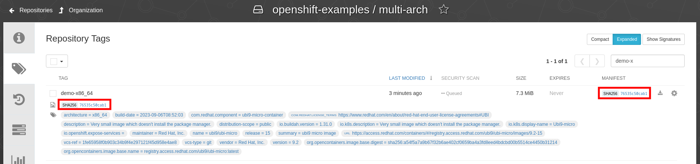
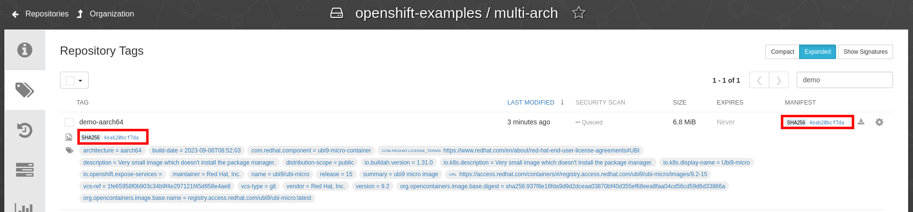
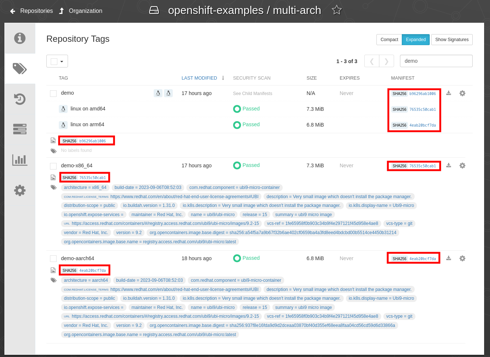

# Demystifying Container Images: Unveiling the Secrets of Multi-Architecture, Manifests, IDs, and Digests

## Build container image (amd64/x86_64)

```bash
[root@x86-instance multi-arch]# buildah bud -f Containerfile \
    -t quay.io/openshift-examples/multi-arch:demo-$(uname -m) .
STEP 1/2: FROM registry.access.redhat.com/ubi9/ubi-micro AS runner
Trying to pull registry.access.redhat.com/ubi9/ubi-micro:latest...
Getting image source signatures
Checking if image destination supports signatures
Copying blob 9e167103aefa done
Copying config 1b9d4f56fb done
Writing manifest to image destination
Storing signatures
STEP 2/2: CMD ["uname","-om" ]
COMMIT quay.io/openshift-examples/multi-arch:demo-x86_64
Getting image source signatures
Copying blob a3ede86005c1 skipped: already exists
Copying blob 5f70bf18a086 done
Copying config 81b91103bc done
Writing manifest to image destination
--> 81b91103bcad
Successfully tagged quay.io/openshift-examples/multi-arch:demo-x86_64
81b91103bcad946edabad074db3e3eefcbfccd307587b6b40257bb0932a31705
```

List images (not pushed, yet)
```
[root@x86-instance multi-arch]# podman images --digests --no-trunc
REPOSITORY                                 TAG          DIGEST                                                                   IMAGE ID                                                                 CREATED         SIZE
quay.io/openshift-examples/multi-arch      demo-x86_64  sha256:66ade3f15bca773a0227d4ff479bb1191b5e5bb94da88bab7307284129bb1733  sha256:81b91103bcad946edabad074db3e3eefcbfccd307587b6b40257bb0932a31705  28 seconds ago  26.1 MB
registry.access.redhat.com/ubi9/ubi-micro  latest       sha256:bd93cff066cc579e49d53f50782f7edad319031e9d511b1e8709cf16be8d78a0  sha256:1b9d4f56fb2cd4401fa14437e3f245e6872388ed3e50f72926234315cbf4f817  3 weeks ago     26.1 MB
```

<details>
  <summary>Discover image details - Manifest (`sha256:66ade3f15bca`)</summary>

### Discover image details - Manifest (`sha256:66ade3f15bca`)

```bash
# Get Digest
[root@x86-instance multi-arch]# skopeo inspect --raw containers-storage:quay.io/openshift-examples/multi-arch:demo-$(uname -m) | sha256sum
INFO[0000] Not using native diff for overlay, this may cause degraded performance for building images: kernel has CONFIG_OVERLAY_FS_REDIRECT_DIR enabled
66ade3f15bca773a0227d4ff479bb1191b5e5bb94da88bab7307284129bb1733  -
```

```json
{
  "schemaVersion": 2,
  "mediaType": "application/vnd.oci.image.manifest.v1+json",
  "config": {
    "mediaType": "application/vnd.oci.image.config.v1+json",
    "digest": "sha256:81b91103bcad946edabad074db3e3eefcbfccd307587b6b40257bb0932a31705",
    "size": 4245
  },
  "layers": [
    {
      "mediaType": "application/vnd.oci.image.layer.v1.tar",
      "digest": "sha256:a3ede86005c19f841273a0c4b8ee64628a029794025b7274cb8cbd4c9d2c6e11",
      "size": 26085888
    },
    {
      "mediaType": "application/vnd.oci.image.layer.v1.tar",
      "digest": "sha256:5f70bf18a086007016e948b04aed3b82103a36bea41755b6cddfaf10ace3c6ef",
      "size": 1024
    }
  ],
  "annotations": {
    "org.opencontainers.image.base.digest": "sha256:a54f5a7a9b67f32b6ae402cf0659ba4a3fd8eed4bdcbd00b5514ce4450b31214",
    "org.opencontainers.image.base.name": "registry.access.redhat.com/ubi9/ubi-micro:latest"
  }
}
```
</details>

<details>
  <summary>Discover image details - Config (`sha256:81b91103bcad`)</summary>

### Discover image details - Config (`sha256:81b91103bcad`)

```bash
# Get ImageID
[root@x86-instance multi-arch]# skopeo inspect --raw  containers-storage:quay.io/openshift-examples/multi-arch:demo-$(uname -m)   | jq '.config.digest'
INFO[0000] Not using native diff for overlay, this may cause degraded performance for building images: kernel has CONFIG_OVERLAY_FS_REDIRECT_DIR enabled
"sha256:81b91103bcad946edabad074db3e3eefcbfccd307587b6b40257bb0932a31705"
[root@x86-instance multi-arch]#
```

`skopeo inspect --config containers-storage:quay.io/openshift-examples/multi-arch:demo-$(uname -m)`:
```json
{
  "created": "2023-10-01T19:27:45.860244628Z",
  "architecture": "amd64",
  "os": "linux",
  "config": {
    "Env": [
      "PATH=/usr/local/sbin:/usr/local/bin:/usr/sbin:/usr/bin:/sbin:/bin"
    ],
    "Cmd": [
      "uname",
      "-om"
    ],
    "Labels": {
	[...snipped...]
    }
  },
  "rootfs": {
    "type": "layers",
    "diff_ids": [
      "sha256:a3ede86005c19f841273a0c4b8ee64628a029794025b7274cb8cbd4c9d2c6e11",
      "sha256:5f70bf18a086007016e948b04aed3b82103a36bea41755b6cddfaf10ace3c6ef"
    ]
  }
  "history": [
	[...snipped...]
  ]
}
```
</details>

## Push container image (amd64/x86_64)

```
[root@x86-instance multi-arch]# podman push quay.io/openshift-examples/multi-arch:demo-$(uname -m)
Getting image source signatures
Copying blob 5f70bf18a086 done   |
Copying blob a3ede86005c1 done   |
Copying config 81b91103bc done   |
Writing manifest to image destination
```




## 😱 Different digest


```bash
# Get Manifest from local image
[root@x86-instance multi-arch]# skopeo inspect --raw containers-storage:quay.io/openshift-examples/multi-arch:demo-$(uname -m) > 66ade3f15bca.json
INFO[0000] Not using native diff for overlay, this may cause degraded performance for building images: kernel has CONFIG_OVERLAY_FS_REDIRECT_DIR enabled

# Get Manifest from image in container registry
[root@x86-instance multi-arch]# skopeo inspect --raw docker://quay.io/openshift-examples/multi-arch:demo-$(uname -m) > 76535c50cab1.json

# Double check sha256sum
[root@x86-instance multi-arch]# sha256sum *json
66ade3f15bca773a0227d4ff479bb1191b5e5bb94da88bab7307284129bb1733  66ade3f15bca.json
76535c50cab1708ff17dc67e93d2a06dea01978f7201d17fd6b28b32f8ce9555  76535c50cab1.json

# "Cleanup" json
[root@x86-instance multi-arch]# jq . 66ade3f15bca.json > 66ade3f15bca.pretty.json
[root@x86-instance multi-arch]# jq . 76535c50cab1.json > 76535c50cab1.pretty.json

# Diff
[root@x86-instance multi-arch]# diff -Nuar 66ade3f15bca.pretty.json 76535c50cab1.pretty.json
```
```diff
--- 66ade3f15bca.pretty.json	2023-10-01 19:41:38.331150221 +0000
+++ 76535c50cab1.pretty.json	2023-10-01 19:41:46.923176546 +0000
@@ -8,14 +8,14 @@
   },
   "layers": [
     {
-      "mediaType": "application/vnd.oci.image.layer.v1.tar",
-      "digest": "sha256:a3ede86005c19f841273a0c4b8ee64628a029794025b7274cb8cbd4c9d2c6e11",
-      "size": 26085888
+      "mediaType": "application/vnd.oci.image.layer.v1.tar+gzip",
+      "digest": "sha256:9e167103aefa56af4c39359687f54fdd263ca85bc946e770d92c054df7ada57c",
+      "size": 7686605
     },
     {
-      "mediaType": "application/vnd.oci.image.layer.v1.tar",
-      "digest": "sha256:5f70bf18a086007016e948b04aed3b82103a36bea41755b6cddfaf10ace3c6ef",
-      "size": 1024
+      "mediaType": "application/vnd.oci.image.layer.v1.tar+gzip",
+      "digest": "sha256:bd9ddc54bea929a22b334e73e026d4136e5b73f5cc29942896c72e4ece69b13d",
+      "size": 34
     }
   ],
   "annotations": {
```

## Build and Push container image (arm64/aarch64)


```bash
[root@arm-instance multi-arch]# buildah bud -f Containerfile \
    -t quay.io/openshift-examples/multi-arch:demo-$(uname -m) .
STEP 1/2: FROM registry.access.redhat.com/ubi9/ubi-micro AS runner
Trying to pull registry.access.redhat.com/ubi9/ubi-micro:latest...
Getting image source signatures
Checking if image destination supports signatures
Copying blob 76f837f08b76 done
Copying config 97f43b6789 done
Writing manifest to image destination
Storing signatures
STEP 2/2: CMD ["uname","-om" ]
COMMIT quay.io/openshift-examples/multi-arch:demo-aarch64
Getting image source signatures
Copying blob 791a6a33d694 skipped: already exists
Copying blob 5f70bf18a086 done
Copying config 01d89888b7 done
Writing manifest to image destination
--> 01d89888b7ef
Successfully tagged quay.io/openshift-examples/multi-arch:demo-aarch64
01d89888b7ef4cb7709345dd8f5f9a9ee352007a613f2b41fed11571f6f53a95
```

List images (not pushed, yet)
```
[root@arm-instance multi-arch]# podman images --digests --no-trunc
REPOSITORY                                 TAG           DIGEST                                                                   IMAGE ID                                                                 CREATED         SIZE
quay.io/openshift-examples/multi-arch      demo-aarch64  sha256:c3bb20ed9d0466c9234763764baab5b5ffd7bd87e5ca2459c889c5ddbe411fbe  sha256:01d89888b7ef4cb7709345dd8f5f9a9ee352007a613f2b41fed11571f6f53a95  31 seconds ago  27.3 MB
registry.access.redhat.com/ubi9/ubi-micro  latest        sha256:bd93cff066cc579e49d53f50782f7edad319031e9d511b1e8709cf16be8d78a0  sha256:97f43b6789e0162674e5fe274a3b39d4894062b4ec8e5b0c4f9305f43223c797  2 weeks ago     27.3 MB
```

<details>
  <summary>Discover image details - Manifest (`sha256:c3bb20ed9d04`)</summary>

### Discover image details - Manifest (`sha256:c3bb20ed9d04`)

```bash
# Get Digest
[root@arm-instance multi-arch]# skopeo inspect --raw containers-storage:quay.io/openshift-examples/multi-arch:demo-$(uname -m) | sha256sum
INFO[0000] Not using native diff for overlay, this may cause degraded performance for building images: kernel has CONFIG_OVERLAY_FS_REDIRECT_DIR enabled
c3bb20ed9d0466c9234763764baab5b5ffd7bd87e5ca2459c889c5ddbe411fbe  -
```

```json
{
  "schemaVersion": 2,
  "mediaType": "application/vnd.oci.image.manifest.v1+json",
  "config": {
    "mediaType": "application/vnd.oci.image.config.v1+json",
    "digest": "sha256:01d89888b7ef4cb7709345dd8f5f9a9ee352007a613f2b41fed11571f6f53a95",
    "size": 4247
  },
  "layers": [
    {
      "mediaType": "application/vnd.oci.image.layer.v1.tar",
      "digest": "sha256:791a6a33d694bf7f1a8a1373b17e2cead2c0e2ee17620cd64128acfa88d2a953",
      "size": 27290112
    },
    {
      "mediaType": "application/vnd.oci.image.layer.v1.tar",
      "digest": "sha256:5f70bf18a086007016e948b04aed3b82103a36bea41755b6cddfaf10ace3c6ef",
      "size": 1024
    }
  ],
  "annotations": {
    "org.opencontainers.image.base.digest": "sha256:937f8e16fda9d9d2dceaa03870bf40d355ef68eea8faa04cd56cd59d6d33866a",
    "org.opencontainers.image.base.name": "registry.access.redhat.com/ubi9/ubi-micro:latest"
  }
}
```
</details>

<details>
  <summary>Discover image details - Config (`sha256:01d89888b7ef`)</summary>

### Discover image details - Config (`sha256:01d89888b7ef`)

```bash
# Get ImageID
[root@arm-instance multi-arch]# skopeo inspect --raw  containers-storage:quay.io/openshift-examples/multi-arch:demo-$(uname -m)   | jq '.config.digest'
INFO[0000] Not using native diff for overlay, this may cause degraded performance for building images: kernel has CONFIG_OVERLAY_FS_REDIRECT_DIR enabled
"sha256:01d89888b7ef4cb7709345dd8f5f9a9ee352007a613f2b41fed11571f6f53a95"
```

`skopeo inspect --config containers-storage:quay.io/openshift-examples/multi-arch:demo-$(uname -m)`:
```json
{
  "created": "2023-07-14T11:49:23.062774594Z",
  "architecture": "amd64",
  "os": "linux",
  "config": {
	"Env": ["PATH=/usr/local/sbin:/usr/local/bin:/usr/sbin:/usr/bin:/sbin:/bin"],
	"Cmd": ["uname","-om"],
	"Labels": {
  		"architecture": "x86_64",
  		"build-date": "2023-06-15T11:05:34",
[...snipped...]
	}
  },
  "rootfs": {
	"type": "layers",
	"diff_ids": [
  		"sha256:e54dc53d0edbbc96d3307fdea7bc1ed433d9083a1aab033dc3b38fd8b4fb165a",
  		"sha256:5f70bf18a086007016e948b04aed3b82103a36bea41755b6cddfaf10ace3c6ef"
	]
  },
  "history": [
	[...snipped...]
  ]
}
```
</details>

## Push container image (amd64/x86_64)

```
[root@arm-instance ~]# podman push quay.io/openshift-examples/multi-arch:demo-$(uname -m)
Getting image source signatures
Copying blob 791a6a33d694 done   |
Copying blob 5f70bf18a086 done   |
Copying config 01d89888b7 done   |
Writing manifest to image destination
```




## 😱 Different digest


```bash
# Get Manifest from local image
[root@arm-instance ~]# skopeo inspect --raw containers-storage:quay.io/openshift-examples/multi-arch:demo-$(uname -m) > c3bb20ed9d04.json
INFO[0000] Not using native diff for overlay, this may cause degraded performance for building images: kernel has CONFIG_OVERLAY_FS_REDIRECT_DIR enabled

# Get Manifest from image in container registry
[root@arm-instance overlay]# skopeo inspect --raw docker://quay.io/openshift-examples/multi-arch:demo-$(uname -m) > 4eab20bcf7da.json

# Double check sha256sum
[root@arm-instance ~]# sha256sum *json
4eab20bcf7da10905cb95ce80141869e84854d15d99454e1365f10286d519f62  4eab20bcf7da.json
c3bb20ed9d0466c9234763764baab5b5ffd7bd87e5ca2459c889c5ddbe411fbe  c3bb20ed9d04.json

# "Cleanup" json
[root@arm-instance ~]# jq . 4eab20bcf7da.json > 4eab20bcf7da.pretty.json
[root@arm-instance ~]# jq . c3bb20ed9d04.json > c3bb20ed9d04.pretty.json

# Diff
[root@arm-instance ~]# diff -Nuar 4eab20bcf7da.pretty.json c3bb20ed9d04.pretty.json
```
```diff
--- 4eab20bcf7da.pretty.json	2023-10-01 19:22:19.243175721 +0000
+++ c3bb20ed9d04.pretty.json	2023-10-01 19:22:33.857304565 +0000
@@ -8,14 +8,14 @@
   },
   "layers": [
     {
-      "mediaType": "application/vnd.oci.image.layer.v1.tar+gzip",
-      "digest": "sha256:76f837f08b7667f5c10d53f91ca4885797a2cfa13f195e9bd024ad9ad934d0d2",
-      "size": 7099212
+      "mediaType": "application/vnd.oci.image.layer.v1.tar",
+      "digest": "sha256:791a6a33d694bf7f1a8a1373b17e2cead2c0e2ee17620cd64128acfa88d2a953",
+      "size": 27290112
     },
     {
-      "mediaType": "application/vnd.oci.image.layer.v1.tar+gzip",
-      "digest": "sha256:bd9ddc54bea929a22b334e73e026d4136e5b73f5cc29942896c72e4ece69b13d",
-      "size": 34
+      "mediaType": "application/vnd.oci.image.layer.v1.tar",
+      "digest": "sha256:5f70bf18a086007016e948b04aed3b82103a36bea41755b6cddfaf10ace3c6ef",
+      "size": 1024
     }
   ],
   "annotations": {
```

## Create multi-arch image / fat-manifest

```
[root@x86-instance multi-arch]# podman manifest create localhost/demo
0deab136998a9b9143d5b253b1b6e8a6d741cfeb5fd9641379a4317ec117bc38
[root@x86-instance multi-arch]# podman manifest add localhost/demo quay.io/openshift-examples/multi-arch:demo-x86_64
0deab136998a9b9143d5b253b1b6e8a6d741cfeb5fd9641379a4317ec117bc38
[root@x86-instance multi-arch]# podman manifest add localhost/demo quay.io/openshift-examples/multi-arch:demo-aarch64
0deab136998a9b9143d5b253b1b6e8a6d741cfeb5fd9641379a4317ec117bc38
[root@x86-instance multi-arch]# podman manifest push localhost/demo quay.io/openshift-examples/multi-arch:demo
Getting image list signatures
Copying 2 images generated from 2 images in list
Copying image sha256:76535c50cab1708ff17dc67e93d2a06dea01978f7201d17fd6b28b32f8ce9555 (1/2)
Getting image source signatures
Copying blob 9e167103aefa skipped: already exists
Copying blob bd9ddc54bea9 skipped: already exists
Copying config 81b91103bc done   |
Writing manifest to image destination
Copying image sha256:4eab20bcf7da10905cb95ce80141869e84854d15d99454e1365f10286d519f62 (2/2)
Getting image source signatures
Copying blob bd9ddc54bea9 skipped: already exists
Copying blob 76f837f08b76 skipped: already exists
Copying config 01d89888b7 done   |
Writing manifest to image destination
Writing manifest list to image destination
Storing list signatures
[root@x86-instance multi-arch]# podman images --digests --no-trunc
REPOSITORY                                 TAG          DIGEST                                                                   IMAGE ID                                                                 CREATED         SIZE
localhost/demo                             latest       sha256:20b959ad5960230b65a77b746bdbf5d991ade4d7a129c2554e167acdcc990531  sha256:0deab136998a9b9143d5b253b1b6e8a6d741cfeb5fd9641379a4317ec117bc38  6 minutes ago   833 B
quay.io/openshift-examples/multi-arch      demo-x86_64  sha256:66ade3f15bca773a0227d4ff479bb1191b5e5bb94da88bab7307284129bb1733  sha256:81b91103bcad946edabad074db3e3eefcbfccd307587b6b40257bb0932a31705  24 minutes ago  26.1 MB
registry.access.redhat.com/ubi9/ubi-micro  latest       sha256:bd93cff066cc579e49d53f50782f7edad319031e9d511b1e8709cf16be8d78a0  sha256:1b9d4f56fb2cd4401fa14437e3f245e6872388ed3e50f72926234315cbf4f817  3 weeks ago     26.1 MB

```

<details>
  <summary>Question: How to predict the Image ID (`6270f63fbb1c`) of the manifest?</summary>

Red Hat internal slack #forum-container-engines: https://redhat-internal.slack.com/archives/CBBJY9GSX/p1696249069114529

```
[root@x86-instance storage]# podman manifest create localhost/demo2
6270f63fbb1c4ae4b18c82936f5be0c6523e77455a2565ee48013807b813a08c
[root@x86-instance storage]# podman images --digests --no-trunc
REPOSITORY                                 TAG          DIGEST                                                                   IMAGE ID                                                                 CREATED         SIZE
localhost/demo2                            latest       sha256:20b959ad5960230b65a77b746bdbf5d991ade4d7a129c2554e167acdcc990531  sha256:6270f63fbb1c4ae4b18c82936f5be0c6523e77455a2565ee48013807b813a08c  20 seconds ago  110 B
[root@x86-instance storage]# cat ./overlay-images/6270f63fbb1c4ae4b18c82936f5be0c6523e77455a2565ee48013807b813a08c/manifest
{"schemaVersion":2,"mediaType":"application/vnd.docker.distribution.manifest.list.v2+json","manifests":null}[root@x86-instance storage]# cat ./overlay-images/6270f63fbb1c4ae4b18c82936f5be0c6523e77455a2565ee48013807b813a08c/manifest | sha256sum
20b959ad5960230b65a77b746bdbf5d991ade4d7a129c2554e167acdcc990531  -
[root@x86-instance storage]# pwd
/var/lib/containers/storage
[root@x86-instance storage]# cat overlay-images/images.json  | jq
..
  {
    "id": "6270f63fbb1c4ae4b18c82936f5be0c6523e77455a2565ee48013807b813a08c",
    "digest": "sha256:20b959ad5960230b65a77b746bdbf5d991ade4d7a129c2554e167acdcc990531",
    "names": [
      "localhost/demo2:latest"
    ],
    "big-data-names": [
      "manifest",
      "instances.json"
    ],
    "big-data-sizes": {
      "instances.json": 2,
      "manifest": 108
    },
    "big-data-digests": {
      "instances.json": "sha256:44136fa355b3678a1146ad16f7e8649e94fb4fc21fe77e8310c060f61caaff8a",
      "manifest": "sha256:20b959ad5960230b65a77b746bdbf5d991ade4d7a129c2554e167acdcc990531"
    },
    "created": "2023-10-01T20:03:26.300473396Z"
  }

..


[root@x86-instance storage]# find | grep 6270
./overlay-images/6270f63fbb1c4ae4b18c82936f5be0c6523e77455a2565ee48013807b813a08c
./overlay-images/6270f63fbb1c4ae4b18c82936f5be0c6523e77455a2565ee48013807b813a08c/manifest
./overlay-images/6270f63fbb1c4ae4b18c82936f5be0c6523e77455a2565ee48013807b813a08c/instances.json


```

</details>


## Discover via quay.io web ui

<https://quay.io/repository/openshift-examples/multi-arch>



## Discover via explore.ggcr.dev

<https://explore.ggcr.dev/?repo=quay.io/openshift-examples/multi-arch>


## Copy & Muli-Arch image and discover

Deploy a registry, for example:
  <https://github.com/openshift-examples/simple-container-registry/>


Copy image into registry:

```bash
export REGISTRY=registry-multi-arch-demo.apps....

skopeo copy --all \
  docker://quay.io/openshift-examples/multi-arch:demo \
  docker://${REGISTRY}/openshift-examples/multi-arch:demo

# Optional - just the tags, blobs already copied.
skopeo copy --all \
  docker://quay.io/openshift-examples/multi-arch:demo-x86_64 \
  docker://${REGISTRY}/openshift-examples/multi-arch:demo-x86_64
skopeo copy --all \
  docker://quay.io/openshift-examples/multi-arch:demo-aarch64 \
  docker://${REGISTRY}/openshift-examples/multi-arch:demo-aarch64

```

Optional, set registry read-only:
```bash =""
oc patch deployment/registry -p '{"spec":{"template":{"spec":{"containers":[{"name":"registry","env":[{"name":"REGISTRY_STORAGE_MAINTENANCE_READONLY","value":"{\"enabled\":true}"}]}]}}}}'
```

### Take a look into the registry

`oc rsh -c tools deployment/registry`:

For example, double check the sha256 change

```bash
sh-4.4# cd /registry/docker/registry/v2/blobs/sha256/76/76f837f08b7667f5c10d53f91ca4885797a2cfa13f195e9bd024ad9ad934d0d2/
sh-4.4# file *
data: gzip compressed data, original size 27290112

sh-4.4# cp data foo.gz
sh-4.4# gzip -d foo.gz
sh-4.4# sha256sum *
76f837f08b7667f5c10d53f91ca4885797a2cfa13f195e9bd024ad9ad934d0d2  data
791a6a33d694bf7f1a8a1373b17e2cead2c0e2ee17620cd64128acfa88d2a953  foo
sh-4.4#
```

## Multi-arch build with Podman Desktop or on Fedora Linux

```bash
export IMAGE='quay.io/openshift-examples/multi-arch:podman-desktop-example'
podman build --platform linux/amd64,linux/arm64  --manifest ${IMAGE}  .
podman manifest inspect ${IMAGE}
podman manifest push ${IMAGE}
skopeo inspect --raw docker://${IMAGE} | jq
```